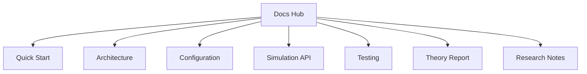

# Project Documentation

This folder is the main documentation hub for the Restaurant analytical simulation project.

## Documentation Map

## Core Guides

- [Quick Start](quick-start.md)
  - Environment setup, first run, and fastest path to validated execution.
- [Architecture](architecture.md)
  - Codebase structure, data flow, and responsibilities by module.
- [Configuration](configuration.md)
  - YAML config layout, validation rules, and compatibility notes.
- [Simulation API](simulation-api.md)
  - Programmatic interface for `simulate_year`, `simulate_batch`, and sweeps.
- [Testing](testing.md)
  - Test suites, commands, and recommended verification sequence.

## Theory and Research

- [Theory report source](tex/report.tex)
- [Theory report PDF](tex/report.pdf)
- [Synthetic data research](research/README.md)

## Recommended Reading Order

1. [Quick Start](quick-start.md)
2. [Configuration](configuration.md)
3. [Simulation API](simulation-api.md)
4. [Testing](testing.md)
5. [Architecture](architecture.md)
