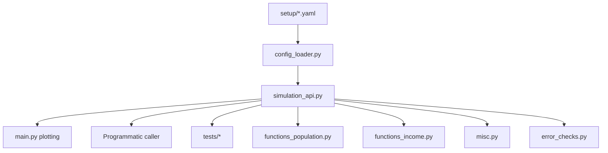
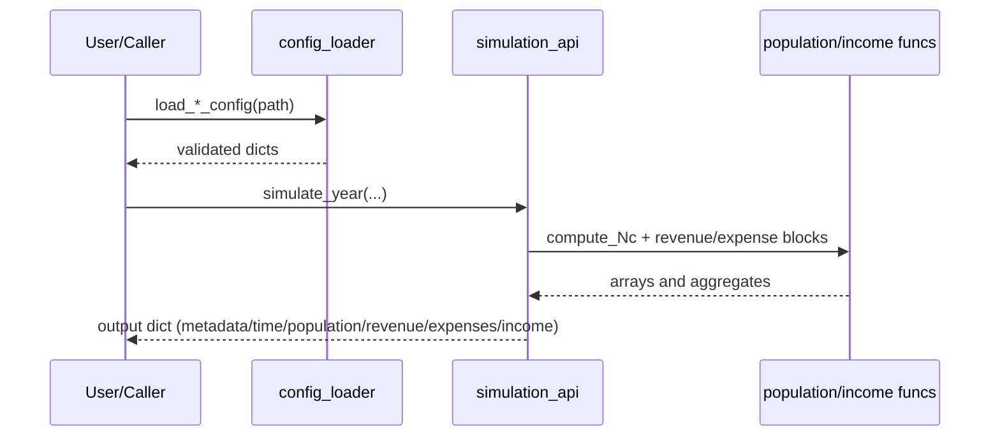

# Architecture

The repository is organized around a strict loader layer, a simulation API layer, and a plotting script layer.

## High-Level Architecture

## Module Responsibilities

- `sources/config_loader.py`
  - Parses `.yaml/.yml` and `.json` configs.
  - Enforces strict schema validation.
  - Raises `ConfigValidationError` on invalid structure.
- `sources/simulation_api.py`
  - Core callable engine (`simulate_year`, `simulate_batch`, `expand_sweep_configs`).
  - Computes population, revenues, expenses, income, and metadata.
- `sources/main.py`
  - Script entrypoint for standalone modeling and figure generation.
  - Uses canonical YAML configs in `setup/` by default.
- `sources/functions_population.py`
  - Attendance/population signal generation (`compute_Nc`).
- `sources/functions_income.py`
  - Revenue and expense primitives (menu, fees, staff, recurring).
- `tests/`
  - Automated intent-based suite (loading, outputs, sweeps, properties, invariants).

## Runtime Data Flow

## Two Primary Use Cases

1. Standalone forward modeling
   - Run `python3 sources/main.py` with YAML configs.
2. Embedded synthetic-data generation
   - Import `sources.simulation_api` and call simulation functions directly from another program.
