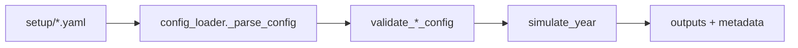

# Configuration

The project is YAML-first for runtime configuration.

## Config Lifecycle

## Canonical Config Files

- `setup/menu_setup_R1.yaml`
- `setup/behavior_setup_r1.yaml`
- `setup/population_setup_R1.yaml`
- `setup/expenses_setup_R1.yaml`

## Loader Entry Points

- `load_menu_config(path_like)`
- `load_behavior_config(path_like)`
- `load_population_config(path_like)`
- `load_expenses_config(path_like)`

All four raise `ConfigValidationError` for missing keys, wrong types, invalid ranges, or malformed structures.

## Validation Rules (Highlights)

- Menu
  - `service_time` must align with `service_list`.
  - Every menu item must define `service`, `price`, `cost`, `daily_proba`.
- Behavior
  - All weekdays must exist in `reference` and `restaurant`.
  - `daily_distributions` entries are strictly length-3 numeric vectors.
- Population
  - `Nworking.places` must be a non-empty mapping.
  - Each place requires `distance`, `Nworkers`, `Commute_fraction`.
- Expenses
  - Payment method probabilities must sum to 1.
  - Staff working-hour intervals must be valid `[start, end]` windows.

## YAML Conventions

- Keep probabilities in `[0, 1]`.
- Keep times in 24-hour format.
- Keep numeric-like place keys quoted (`'0'`, `'1'`) in YAML maps.
- Use comments directly in YAML files for assumptions and field meaning.

## Backward Compatibility

- JSON still loads through `config_loader.py` during transition.
- JSON loading emits a deprecation warning.
- New or updated flows should use YAML paths.
