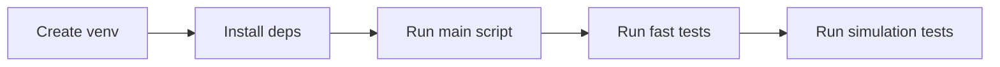

# Quick Start

This guide gets you from clone to validated run in a few minutes.

## Execution Flow



## 1) Environment Setup

```bash
python3 -m venv .venv
.venv/bin/pip install numpy scipy matplotlib pyyaml
```

## 2) Run the Simulation Script

```bash
python3 sources/main.py
```

This generates output plots under `data/plots/`.

## 3) Run Automated Tests

Preferred command groups:

```bash
scripts/run_tests.sh fast
scripts/run_tests.sh simulation
scripts/run_tests.sh properties
```

Full suite:

```bash
scripts/run_tests.sh all
```

## 4) Programmatic API Quick Check

```bash
export PYTHONPATH="$(pwd)/sources:$(pwd)"
.venv/bin/python - <<'EOF'
from sources.config_loader import load_menu_config, load_behavior_config, load_population_config, load_expenses_config
from sources.simulation_api import simulate_year

menu = load_menu_config('setup/menu_setup_R1.yaml')
behavior = load_behavior_config('setup/behavior_setup_r1.yaml')
population = load_population_config('setup/population_setup_R1.yaml')
expenses = load_expenses_config('setup/expenses_setup_R1.yaml')

result = simulate_year(menu, behavior, population, expenses, seed=42, mode='deterministic')
print('Monthly income points:', len(result['income']['month']))
print('Config hash:', result['metadata']['config_hash'])
EOF
```

## 5) Next Reading

- [Configuration](configuration.md)
- [Simulation API](simulation-api.md)
- [Testing](testing.md)
