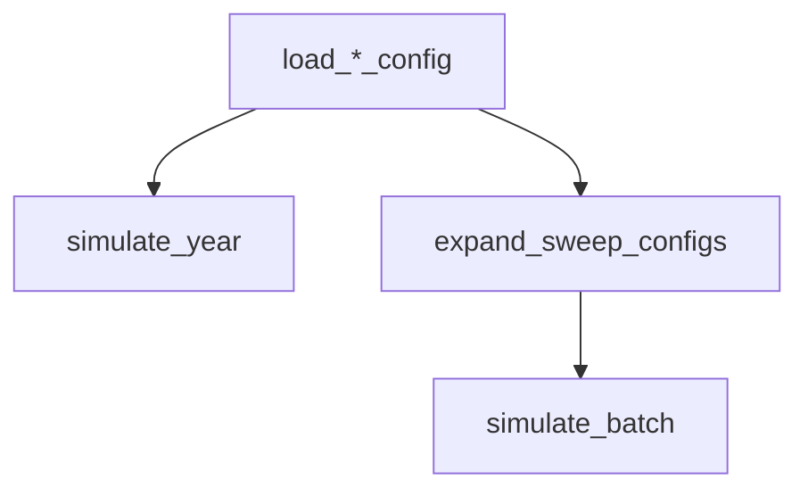
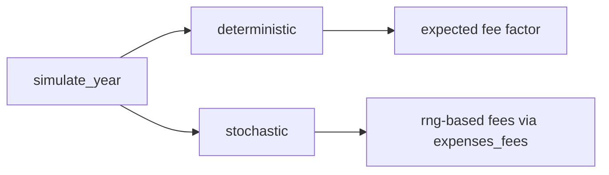

# Simulation API

This page documents the callable API for embedding the model in scripts or other applications.

## API Surface



## Function Signatures

- `simulate_year(menu_cfg, behavior_cfg, population_cfg, expenses_cfg, *, seed=None, mode='deterministic', run_id=None, sweep_id=None, sweep_params=None)`
- `simulate_batch(config_iterable, *, seed=None, n_runs=1, mode='deterministic')`
- `expand_sweep_configs(base_configs, sweep_spec, *, sweep_id='sweep-0')`

## `simulate_year` Return Contract

Top-level keys:

- `metadata`
- `time`
- `population`
- `revenue`
- `expenses`
- `income`

`metadata` includes provenance fields like:

- `config_hash`
- `model_version`
- `seed`
- `mode`
- `rng_kind`
- `rng_state_hash`
- `run_id` / `sweep_id` / `sweep_params`

## Deterministic vs Stochastic Mode



- Deterministic mode computes fee costs via expected payment-weighted factor.
- Stochastic mode samples fees using the RNG path.

## Sweep Example

```python
from sources.config_loader import load_menu_config, load_behavior_config, load_population_config, load_expenses_config
from sources.simulation_api import expand_sweep_configs, simulate_batch

base = {
    'menu_cfg': load_menu_config('setup/menu_setup_R1.yaml'),
    'behavior_cfg': load_behavior_config('setup/behavior_setup_r1.yaml'),
    'population_cfg': load_population_config('setup/population_setup_R1.yaml'),
    'expenses_cfg': load_expenses_config('setup/expenses_setup_R1.yaml'),
}

sweep = {
    'population_cfg.attractiveness.nr': [10, 20, 30],
    'menu_cfg.menu_items.main_evening.daily_proba': [0.10, 0.15],
}

variants = expand_sweep_configs(base, sweep, sweep_id='demo-sweep')
results = simulate_batch(variants, seed=42, n_runs=2, mode='stochastic')
```
