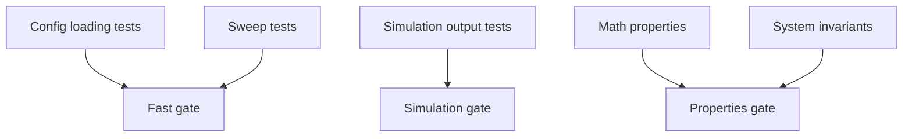

# Testing

Automated tests are organized by intent under `tests/` and run through `scripts/run_tests.sh`.

## Test Layering



## Canonical Commands

```bash
scripts/run_tests.sh fast
scripts/run_tests.sh simulation
scripts/run_tests.sh properties
scripts/run_tests.sh all
```

## Single-Target Execution

```bash
export PYTHONPATH="$(pwd)/sources:$(pwd)"
.venv/bin/python -m unittest tests.test_config_loading
.venv/bin/python -m unittest tests.test_math_properties.TestMathematicalProperties.test_attractiveness_monotonicity
```

## What Each Suite Covers

- `tests/test_config_loading.py`
  - Loader behavior, strict validation, alias normalization, YAML-first compatibility.
- `tests/test_sweep_generation.py`
  - Sweep expansion semantics and batch metadata.
- `tests/test_simulation_outputs.py`
  - Output contract and deterministic reproducibility.
- `tests/test_math_properties.py`
  - Mathematical properties (monotonicity, bounds, integrability patterns).
- `tests/test_system_invariants.py`
  - Accounting identities, non-negativity, seeded stochastic reproducibility.

## Recommended Verification Order

1. `scripts/run_tests.sh fast`
2. `scripts/run_tests.sh simulation`
3. `scripts/run_tests.sh properties`
4. `scripts/run_tests.sh all` (before release or major refactor)
